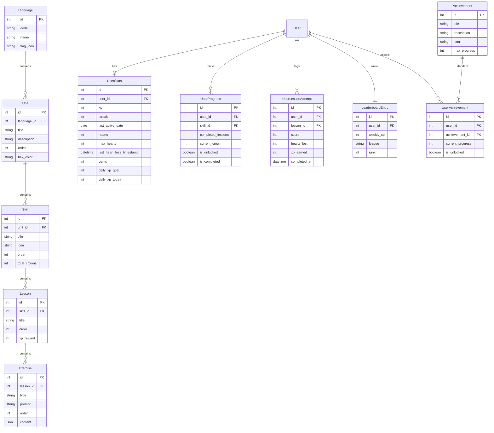

# Duolingo Web App Clone

A full-stack, visually and functionally near-identical clone of the Duolingo language learning web app built for an SDE Fullstack evaluation. 

The application runs end-to-end with pre-seeded data, featuring a snake-style winding learning path, 5 interactive exercise types, real timestamp-based heart regeneration, unit-testable daily streak logic, learner profiles, weekly leaderboards, and gamification achievements.

---

## Tech Stack

- **Frontend:** Next.js 14 (TypeScript, App Router, Tailwind CSS, Lucide Icons, Canvas-Confetti)
- **Backend:** Django 5 + Django REST Framework (DRF)
- **Database:** SQLite (Normalized relational schema)
- **Styling & Aesthetics:** Duolingo signature palette (`#58CC02` Green, `#1CB0F6` Blue, `#FFC800` Gold, `#FF4B4B` Red, `#CE82FF` Purple), Nunito Google typography, chunky 3D buttons, custom original SVG mascot owl.

---

## Quick Start & First-Run Setup

### 1. Backend Setup (Django + DRF)

```bash
cd backend

# Option A: System Python or Virtual Environment
python -m venv venv
# On Windows:
venv\Scripts\activate
# On macOS/Linux:
# source venv/bin/activate

# Install dependencies
pip install django djangorestframework django-cors-headers

# Run database migrations
python manage.py migrate

# Seed initial course data (Spanish course, 4 units, skills, 2-3 lessons/skill, 5-8 exercises/lesson, learners, achievements)
python manage.py seed_data

# Run backend unit tests
python manage.py test api

# Start Django development server (runs on http://localhost:8000)
python manage.py runserver 0.0.0.0:8000
```

### 2. Frontend Setup (Next.js 14)

In a separate terminal:

```bash
cd frontend

# Install Node.js dependencies
npm install

# Start Next.js development server (runs on http://localhost:3000)
npm run dev
```

Open [http://localhost:3000](http://localhost:3000) in your browser.

---

## Database Schema & Foreign Key Relationships

The database schema is fully normalized in Django (`backend/api/models.py`):



### Cascading & Foreign Key Logic
- `Unit` -> `Language` (CASCADE): Deleting a language removes its units.
- `Skill` -> `Unit` (CASCADE): Deleting a unit removes associated skills.
- `Lesson` -> `Skill` (CASCADE): Deleting a skill removes all contained lessons.
- `Exercise` -> `Lesson` (CASCADE): Exercises are bound to their lesson parent.
- `UserProgress`, `UserLessonAttempt`, `UserStats`, `LeaderboardEntry`, `UserAchievement`: Cascade on `User` deletion to ensure cleanup of learner data.

---

## API Overview Table

| Method | Endpoint | Description |
| :--- | :--- | :--- |
| `GET` | `/api/path/` | Returns learning path (units -> skills) with lock/unlock and learner progress state. |
| `GET` | `/api/skills/:id/lesson/` | Fetches lesson payload and ordered sequence of exercises for a skill. |
| `POST` | `/api/lessons/:id/complete/` | Submits lesson results (`score`, `hearts_lost`), awards XP, updates streak, unlocks next skill. |
| `GET` | `/api/user/stats/` | Returns learner stats (XP, streak, hearts recalculated with real timestamp regen, gems). |
| `POST` | `/api/user/hearts/refill/` | Instantly refills hearts to maximum (5/5). |
| `GET` | `/api/leaderboard/` | Returns weekly leaderboard entries across seeded users. |
| `GET` | `/api/user/profile/` | Returns user stats + unlocked achievement badges for profile page. |
| `GET` | `/api/achievements/` | Returns list of all system achievements and progress. |

---

## Features & Implementation Details

1. **5 Interactive Exercise Types**:
   - *Multiple Choice*: Select single correct translation option.
   - *Translate / Word Bank*: Tap word tiles to assemble sentence in order.
   - *Match Pairs*: Grid matching left/right term pairs.
   - *Fill in the Blank*: Select missing word tile to complete sentence.
   - *Type the Answer*: Free text input with case-insensitive whitespace tolerance.
2. **Real Timestamp-Based Hearts Regeneration**:
   - Automatically regenerates 1 heart every 60 minutes after heart loss.
   - Out of hearts modal allows free instant refill or practice mode.
3. **Unit-Testable Streak Calculation**:
   - `update_user_streak` supports date parameter injection for unit testing consecutive activity and missed day resets.
4. **Gamification & UI Flourishes**:
   - Serpentine snaking skill tree with alternating bubble offsets.
   - Timed *Legendary Challenge Mode* toggle for double XP (+20 XP).
   - Animated bottom slide-up drawer for correct/incorrect answer feedback.
   - Confetti celebration modal upon lesson completion.
   - Original SVG mascot owl ("Duo" inspired).
   - Dark mode toggle and responsive layout.

---

## Deployment Configuration

- Backend Deployment: `backend/render.yaml` (compatible with Render / Railway)
- Frontend Deployment: `frontend/vercel.json` (compatible with Vercel with `NEXT_PUBLIC_API_URL` environment variable)
